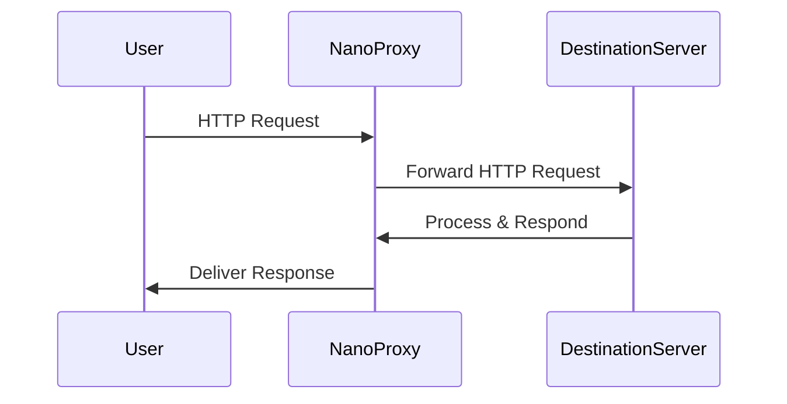

# NanoProxy


[](https://goreportcard.com/report/github.com/ryanbekhen/nanoproxy)

Note: This code includes modifications from the original go-socks5 project (https://github.com/armon/go-socks5)
Modifications have been made as part of maintenance for NanoProxy.
This version is licensed under the MIT license.

NanoProxy is a lightweight proxy server written in Go. It supports both **SOCKS5** and **HTTP Proxy** protocols, making
it flexible for proxying various types of network traffic. NanoProxy is designed to be simple, minimalistic, and easy to
use. It can be run as a standalone service or as a Docker container.

> ⚠️ **Notice:** NanoProxy is currently in pre-production stage. While it provides essential proxying capabilities,
> please be aware that it is still under active development. Full backward compatibility is not guaranteed until
> reaching a stable release. We recommend caution when using NanoProxy for critical production applications. Make sure
> to keep an eye on the changelog and be prepared for manual migration steps as the project evolves.

## Data Flow Through Proxy

NanoProxy acts as a proxy Server that forwards network traffic between the user and the destination Server.
When a user makes a request, the request is sent to the proxy Server. The proxy Server then forwards the request to
the destination Server. The destination Server processes the request and responds back to the proxy Server, which then
sends the response back to the user. This allows the proxy Server to intercept and manage network traffic effectively.

Here's how the data flows through the proxy:


This clear separation of responsibilities helps optimize network communication and enables various proxy-related
functionalities.

## Data Flow Through Proxy with Tor Support

NanoProxy with Tor adds an extra layer of anonymity and privacy to network traffic by using the Tor network. This
enhanced version manages your requests through Tor's decentralized network of nodes, providing better privacy
protection.

Here's how the data flows through the proxy when using Tor support:


## Data Flow Through Proxy with HTTP Support

NanoProxy supports HTTP proxying by handling HTTP requests and forwarding them to the destination server. Depending on
the request method (e.g., GET, POST, CONNECT), NanoProxy processes and forwards the request accordingly.

Here's how the data flows through the proxy when using HTTP support:



This process allows NanoProxy to act as an intermediary between the client and the destination server for HTTP traffic,
ensuring flexibility and traffic management.

### Features of NanoProxy with Tor:

- **Enhanced Anonymity**: Traffic is routed through multiple Tor nodes, making it difficult to trace the origin of the
  request.
- **Automatic IP Rotation**: Changes exit nodes periodically for better anonymity and privacy.
- **Secure Data Transmission**: Encryption between Tor nodes protects data from snooping.

This distinct data flow employing the Tor network ensures that users enjoy increased privacy without compromising on the
flexible functionality of the proxy Server.

### Impact of Using NanoProxy with Tor:

- **High Latency**: Since the traffic must pass through multiple nodes within the Tor network, this can result in
  increased latency. This means that the time it takes for requests to reach their destination and for responses to
  return to the user may be longer compared to direct or non-Tor proxy connections.
- **Lower Bandwidth Speeds**: The Tor network generally has lower bandwidth speeds compared to direct paths, which can
  affect the performance of large data transfers.
- **Connection Stability Limitations**: Due to dynamic routing through various nodes, users might experience more
  frequent connection instability.

Understanding these impacts allows users to make informed decisions about when and how to use NanoProxy with Tor,
especially if anonymity is prioritized over connection speed or stability.

## Features

NanoProxy provides the following features:

- [x] **SOCKS5 proxy Server.** NanoProxy is a SOCKS5 proxy Server that can be used to proxy network traffic for various
  applications.
- [x] **HTTP proxy Server.** NanoProxy can now act as an HTTP proxy Server for forwarding HTTP requests.
- [x] **TOR support.** NanoProxy can be run with Tor support to provide anonymized network traffic (Docker only).
- [x] **IP Rotation with Tor.** NanoProxy allows for IP rotation using the Tor network, providing enhanced anonymity and
  privacy by periodically changing exit nodes.
- [ ] **Authentication Management from Dashboard.** Easily manage user authentication settings and credentials via a
  comprehensive and user-friendly web dashboard, ensuring secure access to proxy features.
- [ ] **Change IP via API.** Programmatically request IP changes through a robust API, facilitating automated and
  dynamic IP management for different use cases.

## Installation

You can easily install NanoProxy using your package manager by adding the official NanoProxy repository.

### Debian and Ubuntu

Add the NanoProxy repository to your source list:

```shell
echo "deb [trusted=yes] https://repo.ryanbekhen.dev/apt/ /" | sudo tee /etc/apt/sources.list.d/ryanbekhen.list
```

Then, update the package list and install NanoProxy:

```shell
sudo apt update
sudo apt install nanoproxy
```

### Red Hat, CentOS, and Fedora

Add the NanoProxy repository configuration:

```shell
sudo tee /etc/yum.repos.d/ryanbekhen.repo <<EOF
[fury]
name=ryanbekhen
baseurl=https://repo.ryanbekhen.dev/yum/
enabled=1
gpgcheck=0
EOF
```

Now, you can install NanoProxy using yum:

```shell
sudo yum update
sudo yum install nanoproxy
```

### MacOS

You can install NanoProxy using Homebrew:

```shell
brew tap ryanbekhen/nanoproxy
brew install nanoproxy
```

### Windows

You can download using winget:

```shell
winget install nanoproxy
```

## Usage

After installing NanoProxy using the provided packages (.deb or .rpm) or accessing it through the repository,
you can manage NanoProxy as a service using the system's service management tool (systemd). To enable NanoProxy to start
automatically on system boot, run the following command:

To enable automatic startup on system boot, run:

```shell
sudo systemctl enable nanoproxy
```

To start the service, run:

```shell
sudo systemctl start nanoproxy
```

## Running on Terminal/Command Prompt

You can also run NanoProxy directly on your terminal/command prompt. To do so, you can use the following command:

```shell
nanoproxy
```

## Running on Docker

You can also run NanoProxy using Docker. To do so, you can use the following command:

```shell
docker run -p 1080:1080 -p 8080:8080 ghcr.io/ryanbekhen/nanoproxy:latest
```

You can also run NanoProxy behind Tor using the following command:

```shell
docker run --rm -e TOR_ENABLED=true -d --privileged --cap-add=NET_ADMIN --sysctl net.ipv6.conf.all.disable_ipv6=0 --sysctl net.ipv4.conf.all.src_valid_mark=1 -p 1080:1080 -p 8080:8080 ghcr.io/ryanbekhen/nanoproxy-tor:latest
```

## Configuration

You can also set the configuration using environment variables. Create a file at `/etc/nanoproxy/nanoproxy` and add the
desired values:

```text
ADDR=:1080
ADDR_HTTP=:8080
NETWORK=tcp
TZ=Asia/Jakarta
CLIENT_TIMEOUT=10s
DNS_TIMEOUT=10s
CREDENTIALS=username:passwordHash
```

For the creation of the password hash, you can use the `htpasswd -nB username` command, but you need to install the
`apache2-utils` package first. To install the package, run the following command:

```shell
sudo apt install apache2-utils
```

Then, you can use the `htpasswd` command to generate the password hash:

```shell
htpasswd -nB username
```

This will prompt you to enter the password. After entering the password, the command will output the username and the
password hash. You can then use the output to set the `CREDENTIALS` environment variable.

The following table lists the available configuration options:

| Name                  | Description                                                     | Default Value |
|-----------------------|-----------------------------------------------------------------|---------------|
| ADDR                  | The address to listen on.                                       | `:1080`       |
| ADDR_HTTP             | The address to listen on for HTTP requests.                     | `:8080`       |
| NETWORK               | The network to listen on. (tcp, tcp4, tcp6)                     | `tcp`         |
| TZ                    | The timezone to use.                                            | `Local`       |
| CLIENT_TIMEOUT        | The timeout for connecting to the destination Server.           | `10s`         |
| DNS_TIMEOUT           | The timeout for DNS resolution.                                 | `10s`         |
| CREDENTIALS           | The credentials to use for authentication.                      | `""`          |
| TOR_ENABLED           | Enable Tor support. (works only on Docker)                      | `false`       |
| TOR_IDENTITY_INTERVAL | The interval to change the Tor identity. (works only on Docker) | `10m`         |

- **ADDR_HTTP**: By default, NanoProxy listens for HTTP proxy traffic on `:8080`. You can set this address to any host:
  port combination for custom setups.
- **CREDENTIALS**: When enabled, both SOCKS5 and HTTP Proxy requests are authenticated using the credentials provided in
  this field. This supports `username:password` pairs.

## Logging

NanoProxy logs all requests and responses to standard output, including SOCKS5 and HTTP Proxy traffic. To view logs for
HTTP Proxy requests, use the `journalctl` command:

```shell
journalctl -u nanoproxy
```

## Testing

To test the proxy using cURL, you can use the `-x` flag followed by the proxy URL. For example, to fetch the Google
homepage using the proxy running on `localhost:8080`, use the following command:

### SOCKS5 Proxy

```shell
curl -x socks5://localhost:1080 https://google.com
```

### HTTP Proxy

```shell
curl -x localhost:8080 https://google.com
```

If credentials are enabled for HTTP Proxy, use the `-U` flag to supply the username and password:

```shell
curl -x http://localhost:8080 -U username:password https://example.com
```

In both cases, replace `localhost:8080` with the actual address and port where your NanoProxy instance is running.

## Authentication for HTTP Proxy

If authentication is enabled (via the `CREDENTIALS` configuration), the HTTP Proxy requires clients to include the
`Proxy-Authorization` header in their requests. The header must use the following format:

```http
Proxy-Authorization: Basic <base64_encoded("username:password")>
```

For example, to use the HTTP Proxy with curl and provide authentication, run:

```shell
curl -x http://localhost:8080 -U username:password https://example.com
```

If authentication fails or is not provided, the proxy will return `407 Proxy Authentication Required` along with the
appropriate `Proxy-Authenticate` header.

## Contributions

Contributions are welcome! Feel free to open issues and submit pull requests.

## Security

If you discover any security-related issues, please email i@ryanbekhen.dev instead of using the issue tracker.

## License

This project is licensed under the MIT License—see the [LICENSE](LICENSE) file for details.
